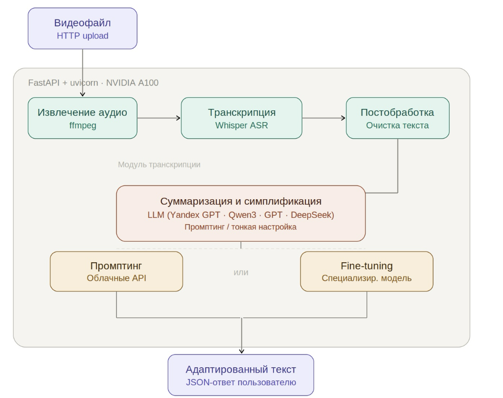
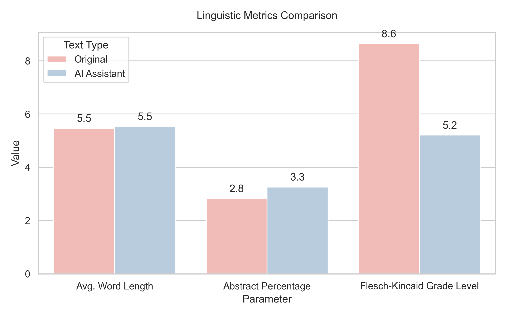

# AI-Powered Lecture Simplification for RFL Tutors 🌐🎓

An automated system designed to simplify and adapt complex academic lectures into accessible materials for future tutors of **Russian as a Foreign Language (RFL / РКИ)**. 

This project was specifically developed for **Zlatoust Publishing House (Издательство «Златоуст»)** to optimize the preparation of pedagogical content and textbooks.

---

## 🎯 Project Overview

Academic lectures are often saturated with complex syntactic structures, high lexical diversity, and abstract terminology, making them difficult for training instructors or intermediate non-native speakers to process. 

This system automates the adaptation pipeline:
1. **Audio/Video Ingestion:** Extracts audio from lecture recordings.
2. **Speech-to-Text (STT):** Generates high-accuracy text transcripts using **OpenAI Whisper**.
3. **AI Adaptation:** Simplifies the transcript, adapting the grammar and vocabulary strictly to the **A2/B1 CEFR levels** of the Russian language.
4. **Linguistic Validation:** Runs an isolated analytics pipeline to comprehensively test the adapted text against the original across dozens of metrics.

---

## 🛣️ Pipeline Architecture

The complete workflow of the text processing and simplification pipeline is illustrated below:

To find the optimal balance between stylistic simplification and semantic accuracy, multiple LLMs were systematically benchmarked.  

📊 Model Evaluation: YandexGPT 5 Pro Analysis

**YandexGPT 5 Pro**:
| Parameter | Original Lecture | Simplified Text |
| :--- | :---: | :---: |
| **Number of Words** | 813.000000 | 276.000000 |
| **Average Word Length** | 5.466175 | 5.525362 |
| **Abstract Lexicon Percentage** | 2.829028 | 3.260870 |
| **Genitive Case Frequency (per 1000 words)** | 89.460784 | 93.525180 |
| **Share of Indirect Cases (%)** | 56.204380 | 67.226891 |
| **Participial Turns (count)** | 11.000000 | 2.000000 |
| **Adverbial Participial Turns (count)** | 6.000000 | 0.000000 |
| **Flesch-Kincaid Grade Level** | 8.643128 | 5.208243 |
| **Flesch Reading Ease Score** | 0.000000 | 0.000000 |
| **SMOG Index** | 0.000000 | 0.000000 |
| **Type-Token Ratio (TTR)** | 0.502481 | 0.682310 |
| **Moving-Average TTR (MATTR)** | 0.826314 | 0.835526 |
| **Measure of Textual Lexical Diversity (MTLD)** | 108.018818 | 151.401263 |
